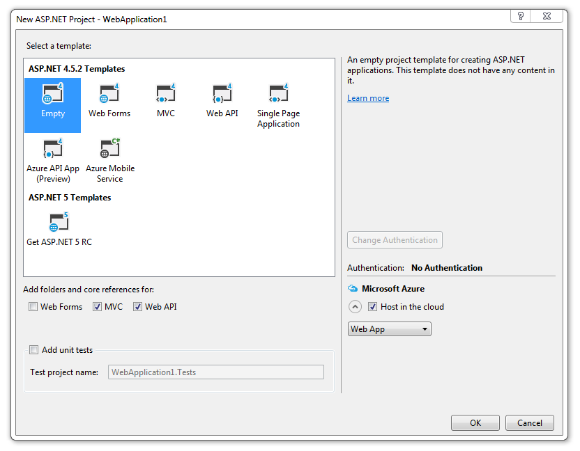
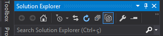
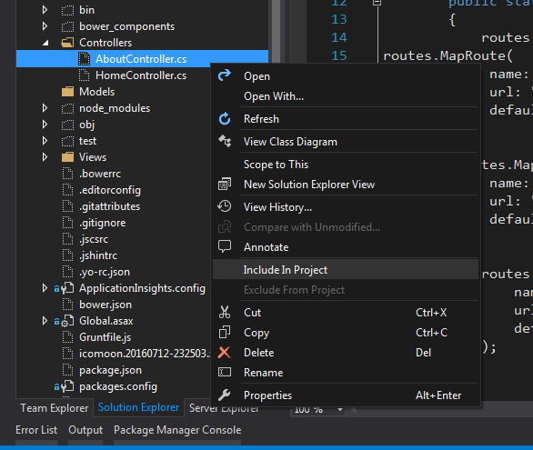

# generator-aspnet-angular [![NPM version][npm-image]][npm-url] [![Build Status][travis-image]][travis-url] [![Dependency Status][daviddm-image]][daviddm-url]
> Asp.Net Project With AngularJS (Based on angular generator)
> A Fork of [AngularJS Generator](https://github.com/yeoman/generator-angular) from the Yeoman team

## Requirements
* Visual Studio with .NET Framework 4.5.2
* Node.js
* Ruby SASS

## Installation

First, install [Yeoman](http://yeoman.io) and generator-aspnet-angular using [npm](https://www.npmjs.com/) (we assume you have pre-installed [node.js](https://nodejs.org/)).

```bash
npm install -g yo
npm install -g generator-aspnet-angular
```
Then, on Visual Studio, create a new ASP.NET Web Application (.NET Framework) and
Select the template as follows:



Then generate your new project from your ASP.NET Project folder:

```bash
yo aspnet-angular
```
This generator is based on official [yeoman angular-generator](https://github.com/yeoman/generator-angular), so the entire front-end structure will be created 
inside of your ASP.NET project folder.

This generator will also modify some files in your ASP.NET project like 'web.config' and 'RouteConfig.cs' from App_Start folder, 
and create some others like Views and Controllers.

Before run your application in Visual Studio, remember to include this newly created Views and Controllers files in your project: 
From Solution explorer sidebar mark 'Show all Files' option:

 

Then right click on hidden files and choose 'Include In Project' option:



## Front-End Development workflow
To create and edit the screens of your application, isn't necessary run your project from Visual Studio.
To take advantage of all the features of the front-end development process like pre-processing css, javascript lint, livereload and package management 
you must open project's folder from your command line tool and run:
 ```bash
 grunt serve
 ``` 
 
## Getting To Know Yeoman

 * Yeoman has a heart of gold.
 * Yeoman is a person with feelings and opinions, but is very easy to work with.
 * Yeoman can be too opinionated at times but is easily convinced not to be.
 * Feel free to [learn more about Yeoman](http://yeoman.io/).

## License

MIT © [@lidia_defreitas](/license)


[npm-image]: https://badge.fury.io/js/generator-aspnet-angular.svg
[npm-url]: https://npmjs.org/package/generator-aspnet-angular
[travis-image]: https://travis-ci.org/lidia-freitas/generator-aspnet-angular.svg?branch=master
[travis-url]: https://travis-ci.org/lidia-freitas/generator-aspnet-angular
[daviddm-image]: https://david-dm.org/lidia-freitas/generator-aspnet-angular.svg?theme=shields.io
[daviddm-url]: https://david-dm.org/lidia-freitas/generator-aspnet-angular
